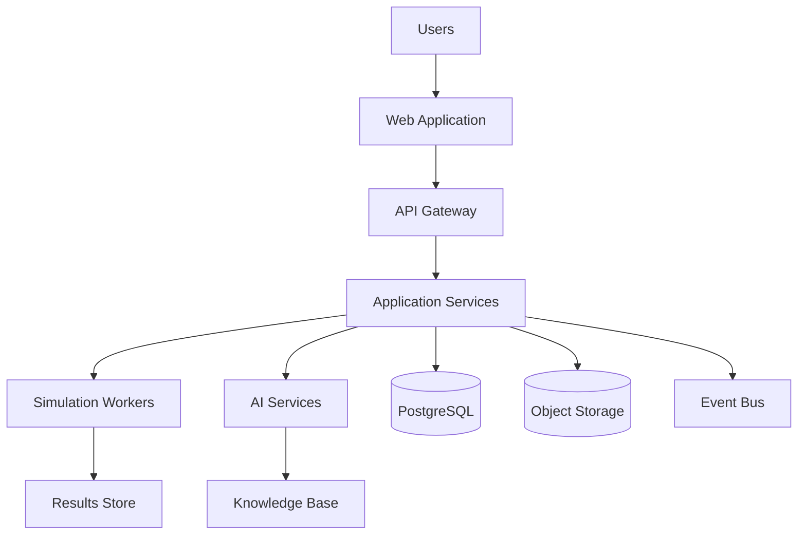

# 04. System Architecture

## 1. Architectural Principles
EngineeringOS will be designed as a modular, cloud-native platform with clear service boundaries, strong data governance, and explicit support for computation-intensive engineering workloads.

## 2. Architectural Overview
The platform includes the following major domains:
- Presentation layer for interactive engineering workspaces
- Application services for workflow orchestration and domain logic
- Simulation execution layer for technical computation
- AI services for reasoning, retrieval, and assistance
- Data layer for relational, object, event, and search storage
- Integration layer for CAD, lab systems, and external tools

## 3. High-Level Component Model
### Presentation Layer
- Browser-based engineering workbenches
- Dashboard, project workspace, simulation studio, CAD workspace, and prototype lab views

### Application Layer
- Project and lifecycle services
- Research and document services
- Calculation services
- Simulation services
- Validation services
- Collaboration services
- AI orchestration services

### Data Layer
- PostgreSQL for transactional and structured engineering records
- Object storage for files and large artifacts
- Search platform for content retrieval
- Event distribution for asynchronous workflows

## 4. Reference Architecture

## 5. Deployment Topology
- Containerized services on Kubernetes
- Managed databases and object storage in cloud infrastructure
- Load balancing, autoscaling, and service-mesh patterns for resilience

## 6. Scalability and Reliability
- Stateless application services for horizontal scaling
- Elastic compute for simulation and AI jobs
- Observability through logs, metrics, distributed tracing, and alerts

## 7. Architectural Constraints
- Strong security and data governance
- Multi-region readiness for future growth
- Compatibility with specialized engineering toolchains
