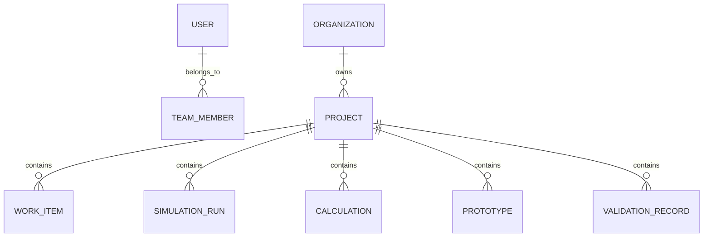

# 05. Database Master Design

## 1. Database Strategy
EngineeringOS will use a polyglot data architecture that combines relational data for transactional consistency, object storage for large engineering artifacts, and search infrastructure for rapid retrieval.

## 2. Core Data Domains
- Identity and access
- Organization and team management
- Projects and lifecycle stages
- Research, documents, and citations
- Calculations and assumptions
- Simulations and outputs
- CAD assets, schematics, and blueprints
- Prototype versions, test results, and validation evidence
- Publications and reusable engineering knowledge

## 3. Relational Model Principles
- Strong primary and foreign key integrity
- Explicit versioning for critical records
- Separate operational data from archival data
- Indexes optimized for search, filtering, and joins

## 4. Reference Entity Model

## 5. Key Storage Patterns
- Relational tables for users, permissions, workflows, and traces
- Object storage for CAD files, images, simulation files, and large datasets
- Search index for documents, metadata, and knowledge assets
- Event tables or activity logs for audit and traceability

## 6. Governance and Scalability
- Role-based access control and row-level security policies
- Version history for artifacts and design revisions
- Partitioning and archival strategies for long-term data growth

## 7. Data Integrity Rules
- Referential integrity for project-linked artifacts
- Unit and metadata validation for calculations and simulations
- Immutable audit fields for authorship and change provenance
