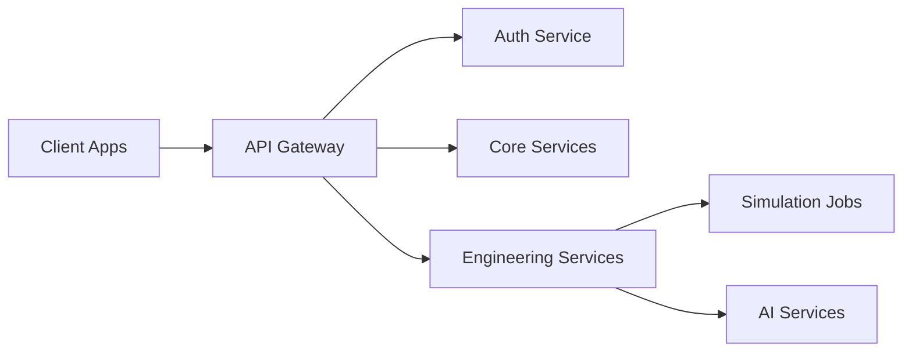

# 06. API Architecture

## 1. API Design Principles
EngineeringOS will be API-first. All core capabilities must be accessible through well-defined interfaces that support web clients, automation tools, external integrations, and internal services.

## 2. API Categories
- Platform APIs for identity, workspaces, organizations, and projects
- Engineering APIs for calculations, simulations, CAD, validation, and prototype workflows
- Knowledge APIs for documents, search, citations, and reusable assets
- Integration APIs for external tools, connectors, and third-party services

## 3. Interface Styles
- REST for resource-oriented workflows
- GraphQL for flexible aggregation in complex workspaces
- WebSocket or Server-Sent Events for live collaboration and job updates
- gRPC for internal service-to-service calls where latency and throughput matter

## 4. Reference API Topology

## 5. Governance Model
- Versioned contracts
- Schema validation
- Rate limiting and throttling
- Endpoint-level authorization and audit logging

## 6.Operational Considerations
- Structured error responses and observability
- Async job submission and callback handling for long-running tasks
- Bulk import/export and event-driven integration patterns
